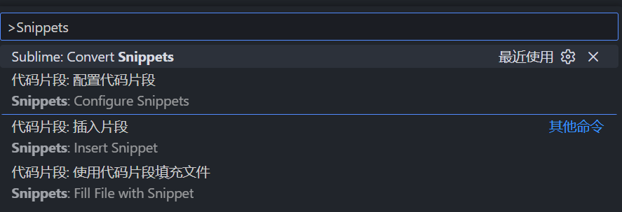
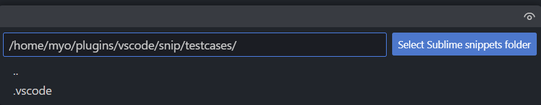
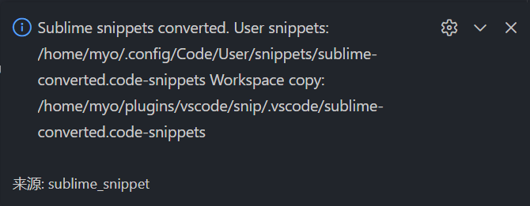

# Sublime Snippet Converter

本项目基于 MIT License 发布，请在使用本项目时遵守相关协议。

本项目是一个用于将 **Sublime Text Snippet** 转换为 **VS Code Snippet** 的 `vsix` 扩展。
拓展会自动识别当前操作系统，并根据系统类型匹配对应的 **VS Code Snippet** 存储目录，将生成的 Snippet 文件写入系统目录中；同时，会在当前工作区中额外拷贝一份，方便用户查看与管理。

## 使用方法

按下组合键 `Ctrl + Shift + P` 调出扩展搜索窗口并输入 `Sublime: Convert Snippets` （或直接搜索 `Snippets`）


选择 `Sublime Snippets` 所在的文件夹


转换成功后，右下角会弹出转换成功的提示：


测试 Snippet 能否正常工作


---
# FOR DEVELOPERS / 开发者

## Environment / 环境准备

### 1. 安装 `Node.js`

前往 `Node.js` 官网 [Node.js](https://nodejs.org/)下载 `Node.js`的 LTS 版本，安装成功后，执行
```shell
node -v
npm -v
```
以验证是否成功安装。

### 2. 安装 `vsce` 扩展打包工具

```shell
npm install -g vsce
```

安装成功后，执行
```shell
vsce --version
```

验证是否成功安装。


## Build & Package / 构建与打包

### 1.安装项目所需依赖

```shell
npm install
```

### 编译插件

```shell
npm run compile
```

该步骤会将 `TypeScript` 编译为 `JavaScript`

### 打包为 `.vsix`文件

```shell
vsce package
```
成功后将生成类似如下文件：
```shell
{@package.name-@package.version}.vsix
```

### 安装 `.vsix` 插件

在 `Visual Studio Code`的“扩展”`(Ctrl + Shift + X)` 的右上角三个点处选择“从 `VSIX` 安装”，或者直接在扩展市场中搜索：`Sublime snippet for VSCode`

